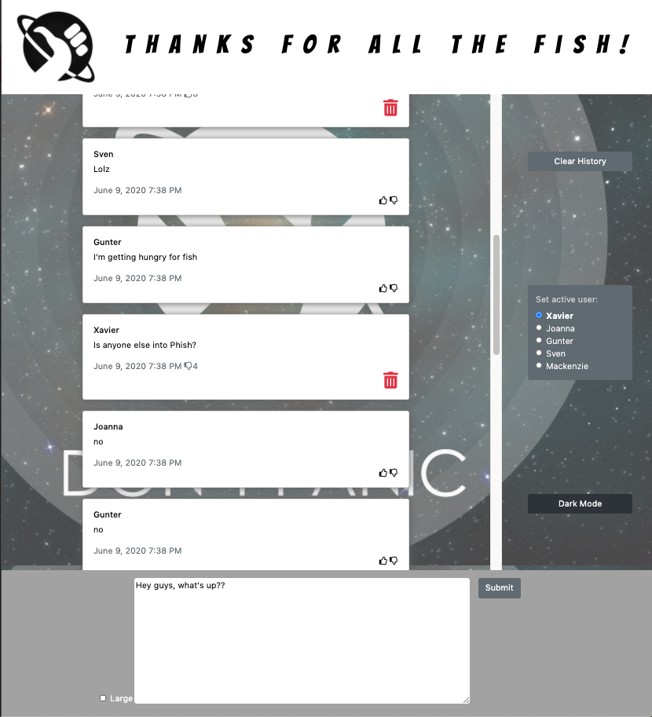

# The Hitchhiker's Guide to the Galaxy Chatting App
A HG2G-themed chatroom simulation app created with HTML , BOOTSTRAP, SASS , and JS. This was built as a group project assignment during my enrollment at [Nashville Software School](http://nashvillesoftwareschool.com/) while we were learning to use modules and webpack for single page web apps.

## Feature List
* Dark/Light theme transitions
* Display maximum of 20 messages
* Select a user to login as
* Delete your messages
* Like or Unlike messages by other users
* Clear all the messages on your feed
* Switch display to Large Text

## How to Run
* Clone Down repo
* Install Npm
* Run 'Npm start' in terminal

## Screenshot

## Developers 
* Nick Walters : https://github.com/nswalters
* Pete Stewart : https://github.com/petestewart72
* Phonesalo Sihanorak : https://github.com/psihanorak
* Jamal Browning : https://github.com/jamalbrowning

## Technologies Used
  
